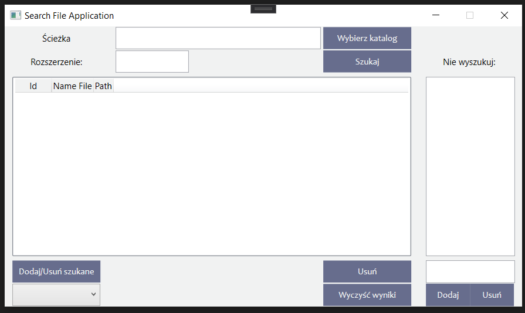
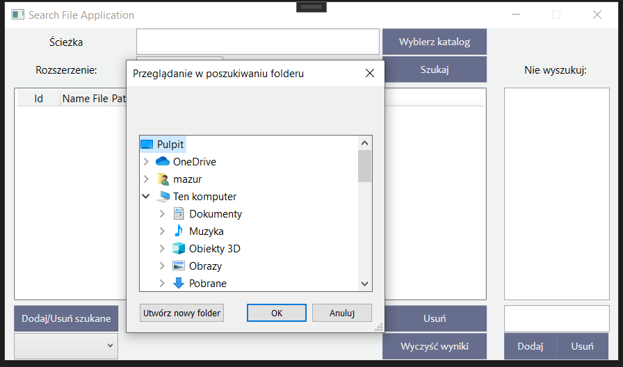
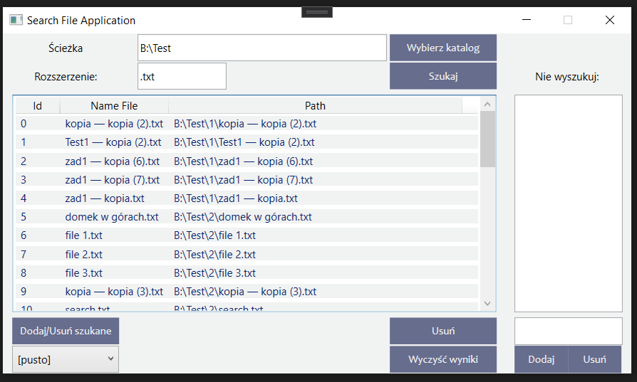
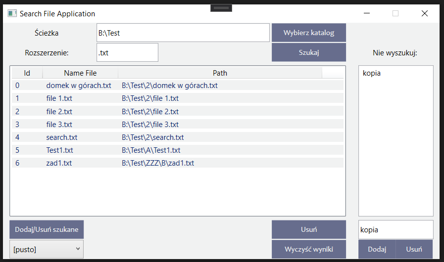
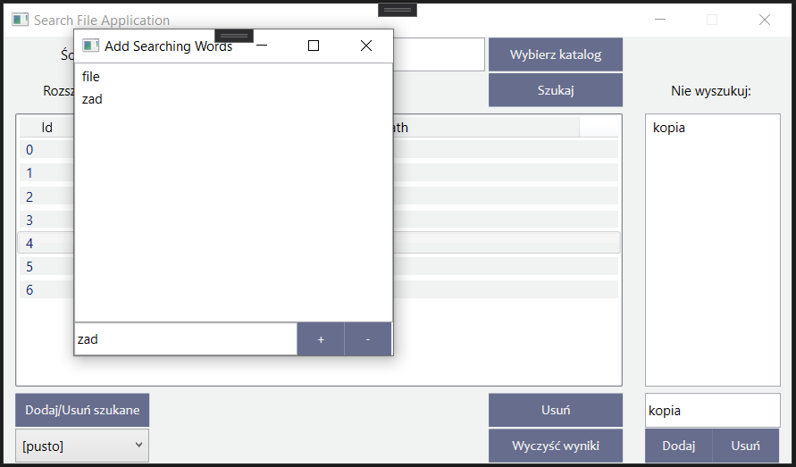
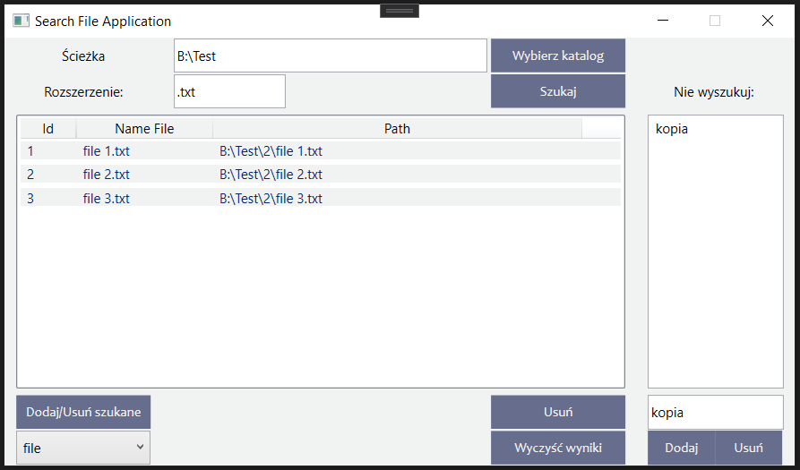

# Search File Application
WPF appliaction created with C# (Visual Studio). It represents a simple searching file appliaction.

## Description
Application:

In the application, select the path in which you want to search for the file by double-clicking in the empty text box or by clicking the 'Wybierz katalog' button.

Then enter the extension in the text box, e.g. .docx (a period is necessary)

You can also complete the field with the names of files that should not be searched.
When you press the 'Szukaj' button the application will search for files in the given directory with the given extension and not included in the unsearchable files.

You can remove an item from the list of received results by clicking 'Usuń' button or 'Wyczyść wyniki'
You can also add a list of words that should be included in the name of the file you are looking for. You can filter them with the Combo box.

